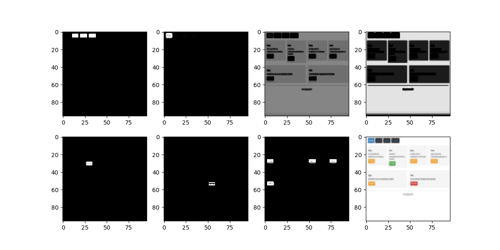

# Summary of results in 2018-09
---

All experiment Codes, Logs and saved Models can be found in folder `AWS:~/bbtai2/featuremap/`.

## featuremap

in order to seperate color space of "blue", "black", "white", "gray", "orange", "yellow", "red", we trained a 2 layer CNN model with [*find_color_weights.py*](./featuremap/find_color_weights.py). the result is shown as following,

