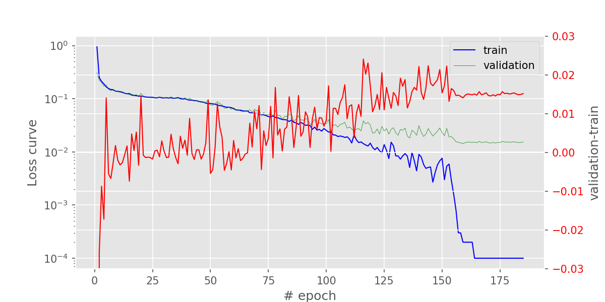

# Summary of results in 2018-09
---

All experiment Codes, Logs and saved Models can be found in folder `AWS:~/bbtai2/featuremap/`.

## featuremap

### find_color_weights.py | conv_color

in order to seperate color space of "blue", "black", "white", "gray", "orange", "yellow", "red", we trained a 2 layer CNN model with [*find_color_weights.py*](./featuremap/find_color_weights.py). the result is shown as following,


then we pretrained a CNN model by using *autoencoder* with [AE_precondition_release3.py](./featuremap/AE_precondition_release3.py). in this model, `conv_color` is used as the highest level layer (fixed during training) to make sure that CNN is able to identify color feature.

### pix2code_v2_20.py

after that the pretrained `Encoder` model in [AE_precondition_release3.py](./featuremap/AE_precondition_release3.py) is used as the CNN part in `EncoderCNN` in [pix2code_v2_20.py](./featuremap/pix2code_v2_20.py), where their weights are fixed during training.

loss curve looks like,


does the gap between training loss and validation loss comes from overfitting, or due to the intrinsic distribution of datasets?

### bootstrapRNN_v1.py | overfitting in DecoderRNN

we encode content in *.gui* files in the following wat,

```
header {
btn-inactive, btn-inactive, btn-active, btn-inactive
}
row {
double {
small-title, text, btn-red
}
double {
small-title, text, btn-green
}
}
row {
single {
small-title, text, btn-green
}
}
row {
quadruple {
small-title, text, btn-green
}
quadruple {
small-title, text, btn-orange
}
quadruple {
small-title, text, btn-green
}
quadruple {
small-title, text, btn-green
}
}
```
to
```
(('btn-inactive', 'btn-inactive', 'btn-active', 'btn-inactive', 'empty'),
('btn-red', 'btn-green', 'empty', 'empty'),
('btn-green', 'empty', 'empty', 'empty'),
('btn-green', 'btn-orange', 'btn-green', 'btn-green'
```
and further
```
[ 0.  1.  0.  0.  1.  0.  0.  0.  1.  0.  1.  0.  1.  0.  0.
  0.  0.  1.  0.  0.  1.  0.  0.  1.  0.  0.  0.  1.  0.  0.  0.  
  0.  1.  0.  0.  1.  0.  0.  0.  1.  0.  0.  0.  1.  0.  0.  0.  
  0.  1.  0.  0.  0.  0.  0.  1.  0.  1.  0.  0.  0.  1.  0.  0.]
```

then trained DecoderRNN as in [bootstrapRNN_v1.py](../featuremap/bootstrapRNN_v1.py).

loss curve is shown in the following figure,



the validation loss saturate at ~0.02, which is extremely similar to what we see in *experiment_201808*. so we conclude that the overfitting of our training mainly comes from DecoderRNN.

observing the difference between validation loss and training loss (red curve), we see that overfitting starts when training loss ~0.06.

### pix2code_v2_21_12_3.py

so in this experiment, we early stopped training when training loss is 0.06, then fixed the weights in DecoderRNN and trained EncoderCNN indivisually.

loss curve of training EncoderCNN indivisually is as following,


as what we imagined, **if we train EncoderCNN only, there will be no overfitting**.

sample of caption generation can be found in [this folder](./featuremap/sample/pix2code_v2_21_12_3). `btn-color` issue has been imporved a lot.

So, in conclusion, two keys to train "EncoderCNN+DecoderRNN" type model are,

1. don't let your DecoderRNN overfit
2. have suitable CNN layers to extract features in EncoderCNN.

---

furthermore, in the case of bootstrap CNN layers can be as simple as `conv_color` plus some downsample pooling layers only. we performed this kind of experiment with GRU instead of LSTM in AWS:~/bbtai2/pix2code/Train_v6.py, which acheived a validation loss smaller than 0.005. but this experiment will not be introduced here since the idea is the same: prevent overfitting in DecoderRNN and get an accurate (and simple) CNN.
